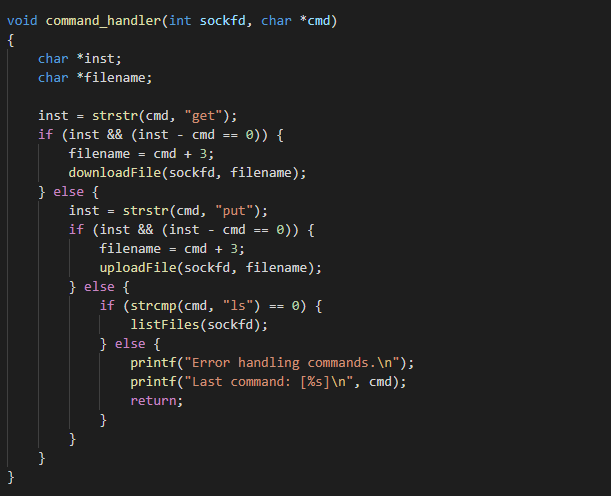
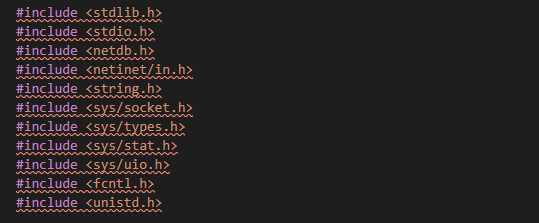
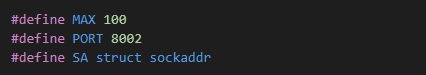
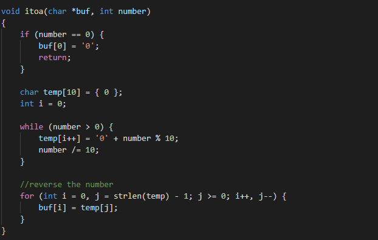
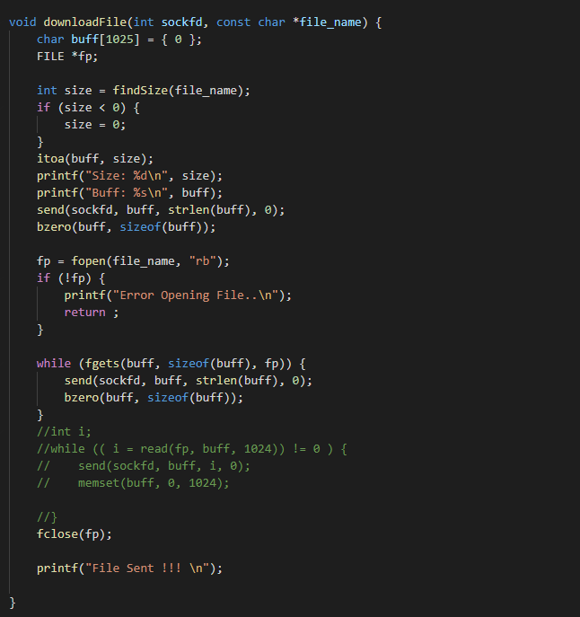
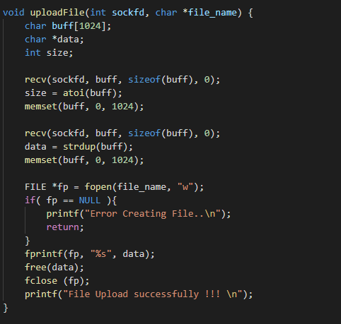
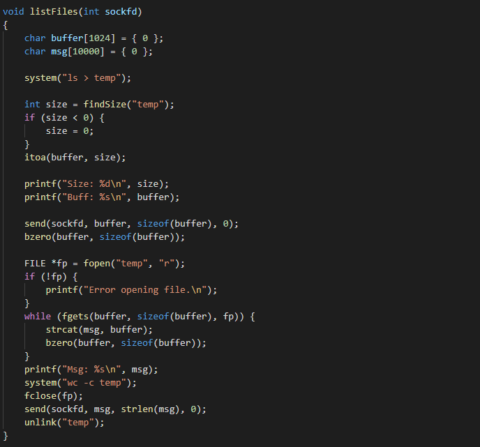
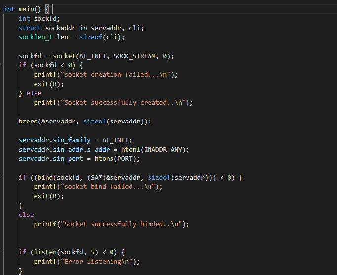



**NETWORK PROGAMING FINAL REPORT**

**FILE STORAGE**

Group 3: 

- Trịnh Quốc Hiếu BI10-060
- Nguyễn Hoàng Sơn BI10-155
- Phạm Anh Hiếu BI9-106 

#
#
#
#
#
#

# Contents
\1. Introduction	

a. Project content	

b. Purpose	

c. Work flow	

\2. Code explanation	

•	Check request from client and match with client’s group	

•	Library and connection to PORT 8002	

•	Convert integer to string	

•	downloadFile / uploadFile / list file	

•	Create a socket	

•	Connect to new client or disconnect to the program	

\3. Demo	

# 1. Introduction	
## a. Project content
\- File storage in online storage system
## b. Purpose
\- Download and upload file 

\- List file 
## c. Work flow 
\- Wait for incoming connection from Load balancer ( port 8002 ) 

\- Check if request is :

- Upload : Store the uploaded file 
- Download : Get the requested file → return to LB
- List : List all the stored file in the storage 

#
# 2. Code explanation 
- ## Check request from client and match with client’s group 

Check the request from client if it upload or download or list file, in the client’s group the commands are get, put, ls  
- ## Library and connection to PORT 8002

- ## Convert integer to string 

Because protocol send file size first then the content, the socket 

only accept string and the file size is integer

- ## downloadFile / uploadFile / list file

Check the size of the file, then the system will send the file to client by

Send 1 msg which contain the file and data to client.

Client send file and data to the storage to store, it's similiar to download file

List file: show the files stored in the storage

Check the request from client if it upload or download or list file

- ## Create a socket 

- ## Connect to new client or disconnect to the program 

`  `Connect to new client and then Interactive to new connected client or disconnect the program. 
# 3. Demo

https://user-images.githubusercontent.com/78504039/122079449-9ee84280-ce27-11eb-914f-b4c4ce50a565.mov

